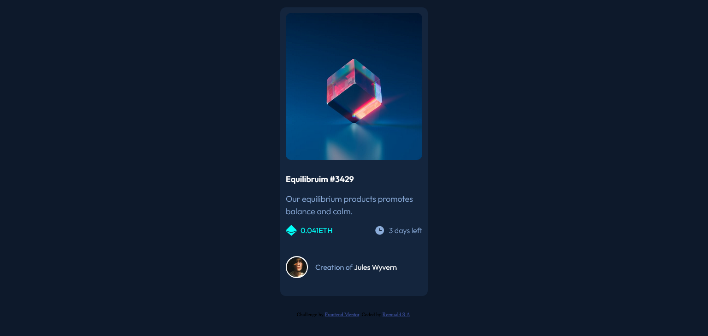

# Frontend Mentor - NFT preview card component solution

This is a solution to the [NFT preview card component challenge on Frontend Mentor](https://www.frontendmentor.io/challenges/nft-preview-card-component-SbdUL_w0U). Frontend Mentor challenges help you improve your coding skills by building realistic projects. 

## Table of contents

- [Overview](#overview)
  - [The challenge](#the-challenge)
  - [Screenshot](#screenshot)
  - [Links](#links)
- [My process](#my-process)
  - [Built with](#built-with)
  - [What I learned](#what-i-learned)
  - [Continued development](#continued-development)
  - [Useful resources](#useful-resources)
- [Author](#author)
- [Acknowledgments](#acknowledgments)

**Note: Delete this note and update the table of contents based on what sections you keep.**

## Overview

### The challenge

Users should be able to:

- View the optimal layout depending on their device's screen size
- See hover states for interactive elements

### Screenshot




### Links

- Solution URL: [https://github.com/rsa015/nft-preview-card-component](https://github.com/rsa015/nft-preview-card-component)
- Live Site URL: [https://rsa015.github.io/nft-preview-card-component/](https://rsa015.github.io/nft-preview-card-component/)

## My process

### Built with

- Semantic HTML5 markup
- CSS custom properties
- Flexbox
- CSS Grid
- Desktop-first workflow


### What I learned

Overlay Effect
```html
<div class = container>
    
    <div class = "overlay_effect>
        <h1>Something</h1>
    </div>
</div>
```
```CSS
    .container {
        position: relative;
    }

    .overlay_effect {
        position: absolute;
        opacity: 0,
    }

    /* overlay effect on container */

    .container:hover .main_image {
        opacity: 0.3;
    }

    .container:hover .overlay_effect {
        opacity: 1;
        pointer: cursor;
    }
```

## Author

- Frontend Mentor - [@rsa015](https://www.frontendmentor.io/profile/rsa015)
- Twitter - [@rs_amegee](https://www.twitter.com/rs_amegee)